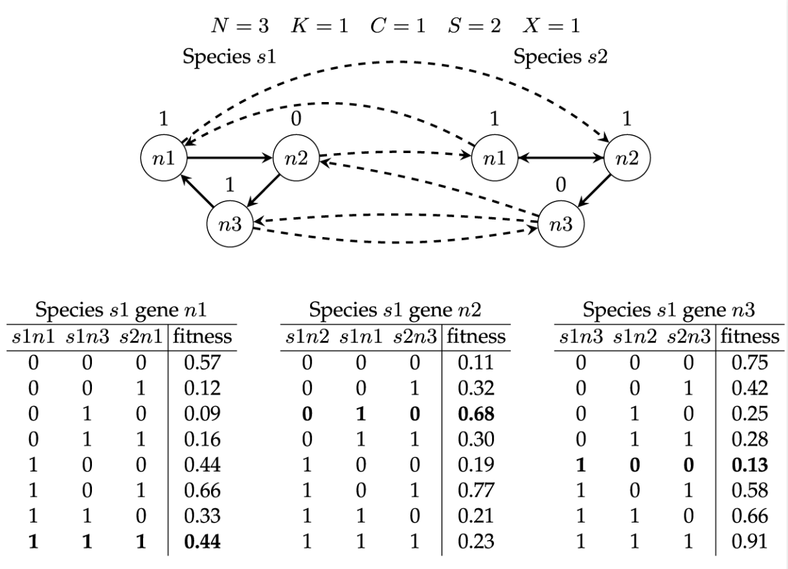

# NKCS Coevolution

NKCS model for exploring aspects of ([surrogate-assisted](https://en.wikipedia.org/wiki/Surrogate_model)) [coevolution](https://en.wikipedia.org/wiki/Cooperative_coevolution).

The NKCS model is the multi-species version of the [NK model](https://en.wikipedia.org/wiki/NK_model) where $S$ species coevolve with $X$ other species. Each species is composed of $N$ genes where each gene is affected by $K$ genes within the same species (internal connections) and $C$ genes within each of the coevolving species (external connections).

It was originally introduced by Kauffman and Johnsen (1991) in [Coevolution to the edge of chaos: Coupled fitness landscapes, poised states and coevolutionary avalanches](https://doi.org/10.1016/S0022-5193%2805%2980094-3) *Journal of Theoretical Biology* 149(4):467-505.

 
Above is an example NKCS model. Each gene is connected to $K$ randomly chosen local genes (solid lines) and to $C$ randomly chosen genes in each of the $X$ other species (dashed lines). A random fitness is assigned to each possible set of combinations of genes. The fitness of each gene is summed and normalised by $N$ to give the fitness of the genome. In the example shown, fitness tables are provided for species $s1$, where the $s1$ genome fitness is 0.416 when $s1$ = [101] and $s2$ = [110].

For further details, see:

Preen and Bull (2017) [On Design Mining: Coevolution and Surrogate Models](https://doi.org/10.1162/ARTL_a_00225) *Artificial Life* 23(2):186-205.

## Usage

Parameters are located in `constants.py`

To run and generate results in the `res` folder:

```
$ python -m nkcs.main
```

## Documentation

See [API documentation](https://rpreen.github.io/nkcs/).
